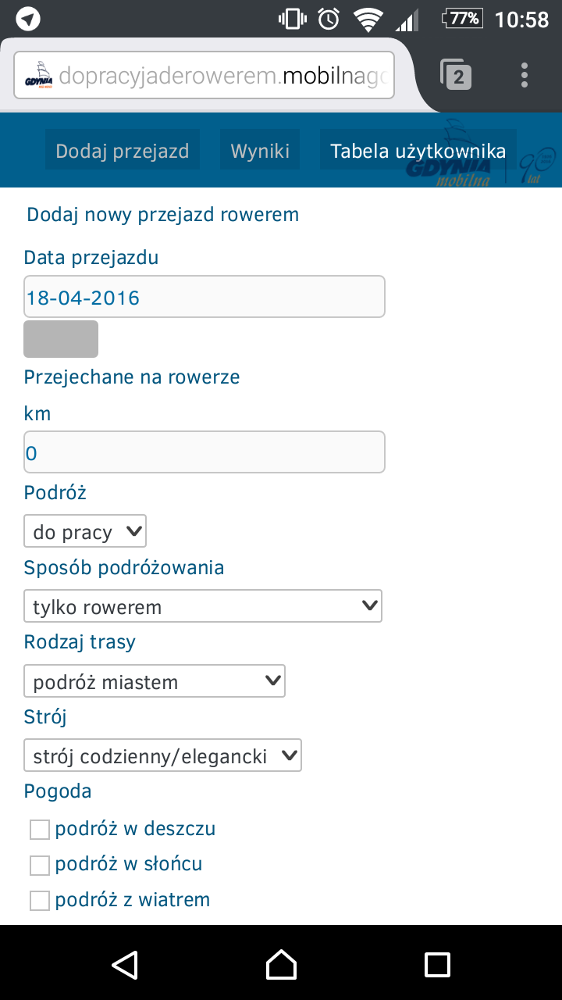
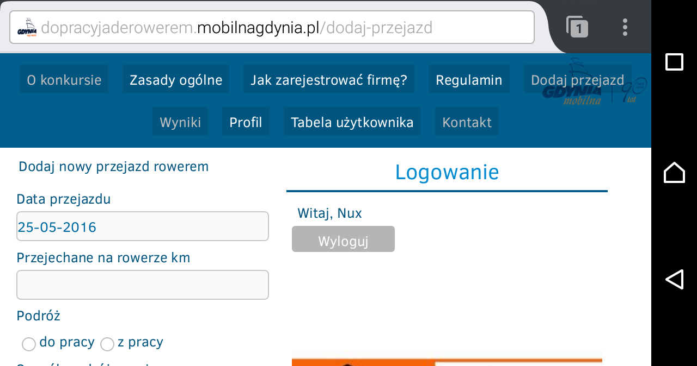

Mobilna Mobilna Gdynia
======================

Czyli dostosowanie witryny konkursu rowerowego Mobilnej Gdyni dla urządzeń przenośnych (komórek i tabletów).

Instalacja
----------

### Firefox ###
1. Zainstaluj rozszerzenie Stylish.
	https://addons.mozilla.org/pl/android/addon/stylish/
2. Zainstaluj rozszerzenie USI.
	https://addons.mozilla.org/pl/android/addon/userunified-script-injector/
3. W Stylish dodaj styl (otwórz URL i skopiuj do Stylish):
	https://goo.gl/EVjfNV
4. W USI zainstaluj JS (wystarczy otworzyć URL w Firefox):
	https://goo.gl/Go0qwJ

Wygląd po instalacji
--------------------

