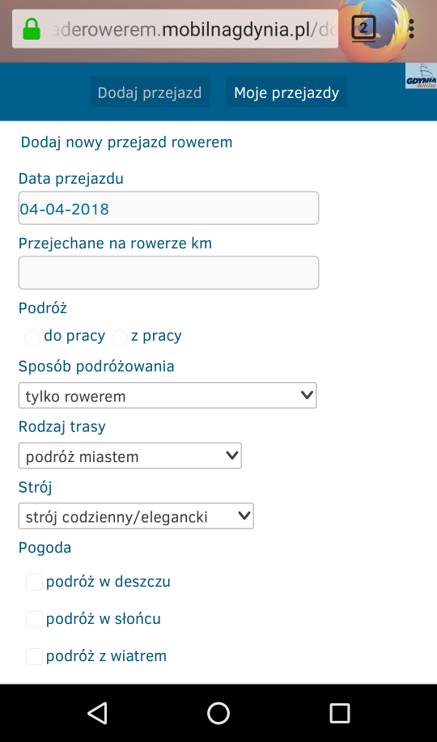

Mobilna Mobilna Gdynia
======================

Czyli dostosowanie witryny konkursu rowerowego Mobilnej Gdyni dla urządzeń przenośnych (komórek i tabletów).

Kod QR dla tej instrukcji:

Instalacja
----------

### Firefox (mobile) ###
1. Zainstaluj [Firefoksa (wersja na Android)](https://play.google.com/store/apps/details?id=org.mozilla.firefox&hl=pl) (jeśli jeszcze nie masz).
2. Zainstaluj [TamperMonkey](https://addons.mozilla.org/pl/firefox/addon/tampermonkey/) (jeśli jeszcze nie masz).
3. Jak już masz TM &rarr; **[zainstaluj skrypt](https://github.com/Eccenux/mobilnagdynia-konkurs-mobilki/raw/master/mobilnagdynia-konkurs-mobilki.user.js)**.

Wygląd po instalacji
--------------------

